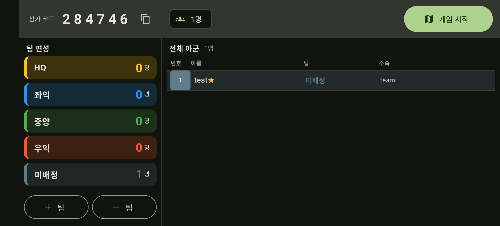
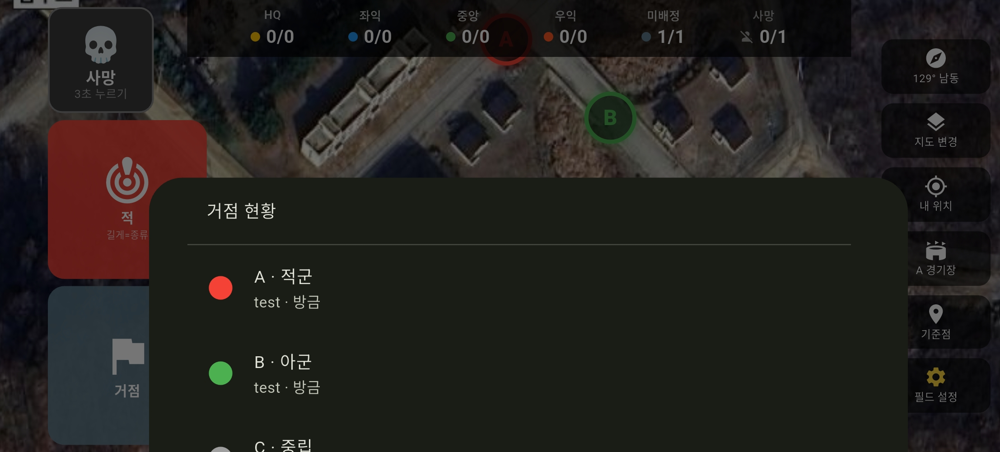

# TacMap

민간 마일즈 전투 경연대회 참가팀을 위한 **분대 전술 상황판** 안드로이드 앱.

무전만으로는 지금 어느 방면이 무너졌는지 알기 어렵습니다.
TacMap은 분대별 생존 인원, 아군의 실시간 위치, 거점 점령 상태를 지도 한 장에 모아,
화면을 잠깐 보는 것만으로 전황을 파악할 수 있게 만든 앱입니다.

한 팀 15명 규모, 경기당 15분 내외의 점령전·섬멸전을 여러 판 치르는 대회 방식에 맞춰 설계했습니다.

> 참가팀이 자체적으로 쓰기 위해 만든 개인 프로젝트입니다.
> 경기장 좌표는 앱에 포함되어 있지 않으며, 운영자가 현장에서 직접 입력합니다.
> 지도는 OpenStreetMap 계열의 공개 지도 서비스를 사용합니다.

---

## 1. 설치하기

안드로이드 폰이면 누구나 설치할 수 있습니다. **안드로이드 7.0 이상**이면 됩니다.
아이폰은 지원하지 않습니다.

### 1단계 — APK 내려받기

APK 파일은 팀 단톡방이나 공유 링크로 배포합니다. 받은 링크를 눌러 **`TacMap.apk`** 를 내려받으세요.

"이런 유형의 파일은 기기에 피해를 줄 수 있습니다" 라는 경고가 뜨면 **다운로드**를 누릅니다.
스토어를 거치지 않은 앱이라 나오는 안내이며, 파일 자체에는 문제가 없습니다.

### 2단계 — 설치 허용하기

스토어가 아닌 곳에서 받은 앱은 한 번만 허용 설정이 필요합니다.

1. 다운로드가 끝나면 알림을 눌러 파일을 엽니다.
2. **"이 출처의 앱 설치 허용"** 안내가 뜨면 **설정**을 누릅니다.
3. 열린 화면에서 **"이 출처 허용"** 을 켭니다. (보통 크롬 또는 내 파일)
4. 뒤로 돌아와 **설치**를 누릅니다.
5. "기기 보호 기능이 앱을 검사했습니다" 같은 안내가 나오면 **무시하고 설치**를 선택합니다.

### 3단계 — 권한 허용하기

앱을 처음 열고 방을 만들거나 참가할 때 두 가지를 묻습니다. **둘 다 허용해야 정상 동작합니다.**

| 권한 | 왜 필요한가 |
|---|---|
| **위치** | 내 위치를 분대원에게 보내기 위해. 없으면 지도에 나만 안 보입니다 |
| **알림** | 다른 앱(음성 채팅 등)을 화면에 띄운 동안에도 위치 전송을 유지하기 위해 |

위치 권한은 **"앱 사용 중에만 허용"** 으로 충분합니다.
실수로 거부했다면 `설정 → 애플리케이션 → TacMap → 권한` 에서 다시 켤 수 있습니다.

---

## 2. 사용법

### 시작하기

1. 앱을 열고 **등번호 · 이름 · 소속**을 입력합니다. 한 번 넣으면 다음부터 기억합니다.
2. 인솔자(방장) 한 명이 **방 만들기**를 누르면 **6자리 참가 코드**가 나옵니다.
3. 나머지 인원은 그 코드를 **코드로 참가** 칸에 입력합니다.
4. 방장이 로비에서 각자를 분대에 배정한 뒤 **게임 시작**을 누릅니다.
   인원이 다 모이지 않아도 언제든 시작할 수 있고, 늦게 들어온 사람도 바로 합류합니다.

### 로비 화면



왼쪽은 분대별 인원 현황, 오른쪽은 전체 명단입니다.
명단에서 사람을 누르면 **분대 배정 · 정보 수정 · 내보내기**를 할 수 있습니다(방장 전용).
본인 정보는 누구나 고칠 수 있습니다.

기본 분대는 HQ · 좌익 · 중앙 · 우익 네 개이며, 방장이 추가하거나 삭제할 수 있습니다.

### 지도 화면

화면 맨 위에 **분대별 생존 인원과 전체 사망자 수**가 한 줄로 표시됩니다.
`좌익 2/5` 처럼 절반 이하로 줄어든 분대는 붉게 바뀌므로, 어느 방면이 밀리는지 즉시 알 수 있습니다.
이 줄을 누르면 전체 분대원 목록(생존 여부, 나와의 거리, 마지막 위치 수신 시각)이 열립니다.

지도 위 표시는 다음과 같습니다.

| 표시 | 의미 |
|---|---|
| 색 원 + 부채꼴 | 분대원의 위치와 바라보는 방향. 색은 소속 분대이며, 나와 같은 분대는 더 크고 밝게 빛납니다 |
| 회색 원 + ✕ | 사망 처리된 분대원 |
| 검은 원 안 사람 아이콘 | 사망이 발생한 지점. 5분간 남습니다 |
| 빨간 표식 | 분대원이 찍은 적 위치. 60초에 걸쳐 옅어지며 사라집니다 |
| 알파벳이 든 원 | 거점. 초록은 아군, 빨강은 적군, 회색은 중립 |
| 집 모양 배지 | 분대 리스폰 지점 |
| 노란 다각형 | 경기장 경계 |

### 조작

화면은 가로 방향 고정입니다. 지도를 넓게 쓰기 위해 조작 버튼을 좌우 양끝에 배치했습니다.

**왼쪽 (전투 조작)**

| 버튼 | 동작 |
|---|---|
| 사망 | **3초간 누르고 있으면** 사망 처리됩니다. 누르는 동안 화면 한가운데에 남은 시간이 표시되며, 손을 떼면 취소됩니다 |
| 적 | 화면 중앙 십자선 위치에 적 표식을 찍습니다. **길게 누르면** 종류(적 · 저격 · 위험 · 집결)를 고를 수 있습니다 |
| 거점 | 거점 목록을 열어 점령 상태를 아군/적군/중립으로 바꿉니다 |

이동 중에 지도를 정확히 누르는 것은 어렵기 때문에, 표식은 **지도를 옮겨 십자선을 맞춘 뒤 버튼을 누르는** 방식으로 찍습니다.

**오른쪽 (지도 조작)**

| 버튼 | 동작 |
|---|---|
| 나침반 | 현재 방위를 표시합니다. 누르면 북쪽 고정 ↔ 진행방향 위 전환 |
| 지도 변경 | 배경 지도를 바꿉니다 |
| 내 위치 | 내 위치로 지도를 이동 |
| 경기장 | A · B 경기장 전환 |
| 기준점 | 경기장 중심으로 이동. **길게 누르면** 좌표를 직접 입력 |
| 필드 설정 | 방장 전용 (아래 참고) |

**진동 알림** — 화면을 보고 있지 않아도 상황을 알 수 있도록 진동 패턴을 구분했습니다.
아군 사망은 짧게 한 번, 거점 상태 변경은 길게 두 번 울립니다.

### 관전으로 참가하기

경기에 뛰지 않는 인원은 첫 화면에서 **관전으로 참가**를 체크하고 들어옵니다.
관전자는 자기 위치를 보내지 않고 상황만 보되, **거점 점령 상태는 갱신할 수 있습니다.**
무전을 듣고 대신 반영해 주는 역할에 적합합니다. 생존 인원 집계에서도 빠집니다.

방장이 로비에서 다른 사람을 관전으로 바꾸거나 되돌릴 수도 있습니다.

### 다른 앱과 함께 쓰기

음성 채팅 앱을 화면에 띄워 둔 상태에서도 위치 전송이 유지됩니다.
알림창에 `TacMap 위치 공유 중` 이라는 줄이 떠 있으면 정상 동작 중이라는 뜻입니다.

---

## 3. 방장(운영자) 기능

지도 화면 오른쪽 **필드 설정**에서 사용합니다.



- **경기장 좌표 입력** — 기준점 버튼을 길게 눌러 좌표를 넣습니다. 입력한 값은 기기에 저장됩니다
- **거점 등록 · 삭제** — 지도를 옮겨 십자선을 맞춘 뒤 이름(A, B, C …)을 입력합니다
- **분대 리스폰 지점 지정** — 분대별 시작 위치를 표시합니다
- **경기장 경계 설정** — 꼭짓점을 하나씩 찍어 다각형으로 그립니다
- **라운드 초기화** — 한 경기가 끝나면 전원 사망 표시를 풀고, 적 표식과 기록을 지우고,
  거점을 중립으로 되돌립니다. 거점 위치 · 리스폰 · 경계는 유지되므로 바로 다음 경기를 시작할 수 있습니다
- **전적 보기** — 분대별 · 개인별 사망 횟수와 거점 상태 변경 횟수를 집계합니다. 경기 후 돌아볼 때 씁니다
- **전체 기록** — 누가 몇 시 몇 분에 사망했고, 거점 상태를 누가 언제 바꿨는지 시각과 함께 남습니다.
  점령 표시를 잘못 눌렀을 때 누구의 조작이었는지 확인할 수 있습니다
- **지도 미리 받기** — 기준점 반경 약 1.2km의 지도를 기기에 저장합니다.
  통신이 끊겨도 지도는 그대로 보입니다. **대회 전 와이파이에서 미리 받아두세요**
- **필드 프리셋** — 미리 잡아둔 거점 · 리스폰 · 경계 배치를 저장해 두었다가,
  당일 새로 만든 방에 그대로 불러옵니다

거점 점령 상태는 방장이 아니어도 누구나 바꿀 수 있습니다.
현장에서 무전으로 듣고 지휘부가 대신 갱신하는 경우가 많기 때문입니다.

---

## 4. 지도 선택

배경 지도는 공개 지도 서비스 중에서 고를 수 있습니다.

| 지도 | 쓰임새 |
|---|---|
| **등고선** (기본) | 능선과 계곡을 읽어야 하는 지형 |
| 위성 | 건물과 도로를 눈으로 확인 |
| 일반 지도 | 도로 위주의 단순한 화면 |

---

## 5. 기술 구성

| 영역 | 선택 | 이유 |
|---|---|---|
| 앱 | Flutter (Dart) | 화면·지도·위치·통신을 한 언어로 처리. APK 빌드가 단순 |
| 서버 | Firebase Realtime Database | 별도 서버 없이 실시간 동기화. 전송량 기준 과금이라 2초 주기 위치 갱신에 적합 (Firestore는 쓰기 건수로 과금해 15명 규모에서 무료 한도를 넘김) |
| 인증 | Firebase 익명 인증 | 회원가입 없이 참가하되, 서버가 "누가 보낸 데이터인지"는 구분할 수 있어야 하므로 |
| 지도 | flutter_map + 교체 가능한 타일 소스 | API 키와 과금 없이 공개 지도만으로 운영 |

### 데이터 구조

```
/rooms/{6자리코드}
  meta          : 방장 uid, 진행 상태
  teams/{id}    : 분대 이름, 색, 순서
  members/{uid} : 등번호, 이름, 소속, 분대, 방장 · 관전 여부
  live/{uid}    : 위경도, 정확도, 방위각, 시각, 사망 여부
  markers/{id}  : 적 표식
  objectives/{id}: 거점 (이름, 좌표, 소유)
  spawns/{teamId}: 분대 리스폰 지점
  boundary      : 경기장 경계 좌표 배열
  events/{id}   : 사망·복귀·거점 변경 기록

/presets/{id}   : 저장해둔 필드 배치 (거점·리스폰·경계)
```

설계상 짚어둘 점

- 위치(`live`)를 명단(`members`)과 분리했습니다. 위치가 2초마다 바뀌어도 명단 화면이 다시 그려지지 않습니다.
- 적 표식은 서버에서 지우지 않고, 생성 시각을 기준으로 각 기기가 걸러 냅니다.
  서버 함수가 필요 없어 무료 등급 안에서 운영됩니다.
- 권한은 앱이 아니라 **데이터베이스 보안 규칙**으로 강제합니다.
  방장이 아닌 사람이 남의 정보를 고치거나 내보내려 하면 서버가 거부합니다.
- 지도 타일은 기기에 저장해 두고 먼저 꺼내 씁니다. 통신이 끊겨도 이미 받아둔 영역은 그대로 표시됩니다.
- **경기장 좌표는 코드에 포함하지 않습니다.** 운영자가 앱에서 입력한 값만 기기와 방 데이터에 남습니다.

---

## 6. 직접 빌드하기

Flutter SDK와 Android SDK가 필요합니다. 최소 지원 버전은 Android 7.0 (API 24)입니다.

```bash
flutter pub get
flutter test
flutter build apk --release
```

Firebase 설정 파일(`lib/firebase_options.dart`, `android/app/google-services.json`)과
서명 키는 저장소에 포함하지 않습니다. 본인 Firebase 프로젝트를 만들어 생성하세요.

```bash
firebase projects:create <프로젝트id>
flutterfire configure --project=<프로젝트id> --platforms=android
firebase deploy --only database   # database.rules.json 배포
```

Firebase 콘솔에서 **Realtime Database**와 **익명 로그인**을 사용 설정해야 합니다.

---

## 라이선스

팀 내부 운영을 위해 제작한 프로젝트입니다.

지도 타일은 각 제공처의 이용약관을 따릅니다.
OpenTopoMap (CC-BY-SA), OpenStreetMap 기여자, Esri / Maxar.
